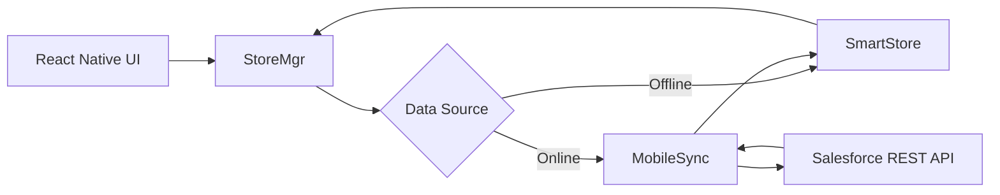
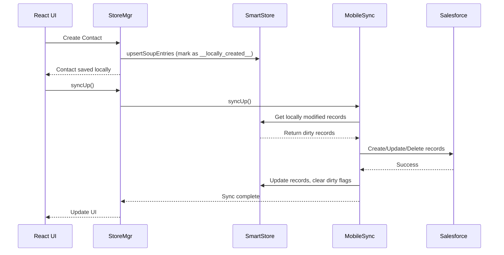
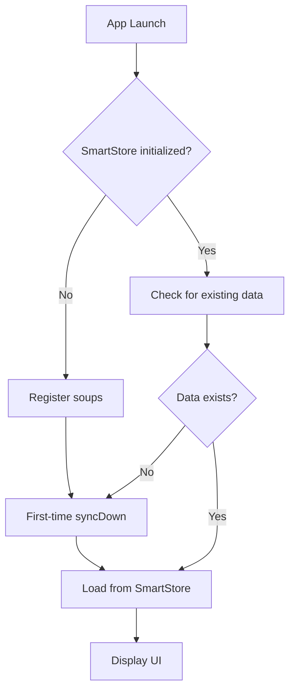
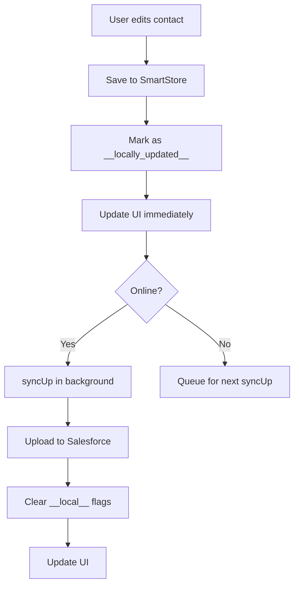

# MobileSyncExplorerReactNative

The complete sample application demonstrating offline data synchronization with the Salesforce Mobile SDK.

## Overview

`MobileSyncExplorerReactNative` is a **full-featured reference application** that showcases best practices for building offline-first mobile apps with React Native and Salesforce Mobile SDK.

Key features:

- **Complete CRUD operations** (Create, Read, Update, Delete) for Contacts
- **Offline data storage** with SmartStore
- **Bidirectional sync** with MobileSync (download and upload)
- **Conflict resolution** for concurrent edits
- **Search functionality** with full-text search
- **Real-world UI patterns** with React Navigation
- **Event-driven architecture** for sync state management
- **Production-ready code structure**

## When to Use This Template

**Use MobileSyncExplorerReactNative if:**

- You're learning the Mobile SDK and want a complete example
- You need to understand offline data synchronization
- You're building an offline-first application
- You want to see best practices for CRUD operations
- You need a reference for SmartStore and MobileSync usage

**Don't use as a starting point if:**

- You're starting a new app from scratch → Use [ReactNativeTemplate](./ReactNativeTemplate.md)
- You don't need offline sync → Use [ReactNativeTemplate](./ReactNativeTemplate.md)
- You want a minimal template → This is a full sample app, not a minimal template

## Creating the Sample App

```bash
forcereact create \
  --appname MobileSyncExplorer \
  --packagename com.mycompany.mobilesyncexplorer \
  --organization "My Company" \
  --templatename MobileSyncExplorerReactNative
```

## What This Sample Demonstrates

### 1. Offline-First Architecture



### 2. Sync Operations

| Operation | Description | When to Use |
|-----------|-------------|-------------|
| **syncDown** | Download records from Salesforce to SmartStore | Initial load, refresh data |
| **syncUp** | Upload local changes to Salesforce | Save offline edits |
| **reSync** | Re-run previous syncDown | Pull latest changes |

### 3. CRUD Workflow



## Project Structure

```
MobileSyncExplorerReactNative/
├── package.json                 # Dependencies and SDK references
├── index.js                     # React Native entry point
├── metro.config.js              # Metro bundler configuration
├── babel.config.js              # Babel configuration
├── js/                          # JavaScript source code
│   ├── App.js                   # Main application component
│   ├── SearchScreen.js          # Contact list and search
│   ├── ContactScreen.js         # Contact detail and edit
│   ├── StoreMgr.js              # SmartStore and MobileSync manager
│   ├── events.js                # Event emitter for state management
│   ├── ContactCell.js           # Contact list item component
│   ├── ContactBadge.js          # Contact avatar component
│   ├── Field.js                 # Form field component
│   ├── NavImgButton.js          # Navigation button component
│   └── Styles.js                # Shared styles
├── ios/                         # iOS native project
└── android/                     # Android native project
```

## Key Files

### js/App.js

Main application component with navigation setup.

```javascript
import React from 'react';
import { NavigationContainer } from '@react-navigation/native';
import { createStackNavigator } from '@react-navigation/stack';
import SearchScreen from './SearchScreen';
import ContactScreen from './ContactScreen';

const Stack = createStackNavigator();

export default function App() {
  return (
    <NavigationContainer>
      <Stack.Navigator initialRouteName="Search">
        <Stack.Screen 
          name="Search" 
          component={SearchScreen}
          options={{ title: 'Mobile Sync Explorer' }}
        />
        <Stack.Screen 
          name="Contact" 
          component={ContactScreen}
          options={{ title: 'Contact Details' }}
        />
      </Stack.Navigator>
    </NavigationContainer>
  );
}
```

### js/StoreMgr.js

The heart of the application - manages SmartStore and MobileSync operations.

**Key functions:**

```javascript
// Register SmartStore soup (table)
function firstTimeSyncData() {
    return registerSoup(false, 'contacts', [
        { path: 'Id', type: 'string' },
        { path: 'FirstName', type: 'full_text' },
        { path: 'LastName', type: 'full_text' },
        { path: '__local__', type: 'string' }
    ]);
}

// Download contacts from Salesforce
function syncDownContacts() {
    const fieldlist = ['Id', 'FirstName', 'LastName', 'Title', 'Email', 
                       'MobilePhone', 'Department', 'LastModifiedDate'];
    const target = {
        type: 'soql',
        query: `SELECT ${fieldlist.join(',')} FROM Contact LIMIT 10000`
    };
    
    return syncDown(
        false,              // isGlobalStore
        target,             // sync target
        'contacts',         // soupName
        { mergeMode: mobilesync.MERGE_MODE.OVERWRITE },
        'mobileSyncExplorerSyncDown' // syncName
    );
}

// Upload local changes to Salesforce
function syncUpContacts() {
    const fieldlist = ['FirstName', 'LastName', 'Title', 'Email', 
                       'MobilePhone', 'Department'];
    
    return syncUp(
        false,              // isGlobalStore
        {},                 // options
        'contacts',         // soupName
        { 
            mergeMode: mobilesync.MERGE_MODE.OVERWRITE,
            fieldlist: fieldlist
        }
    );
}

// Search contacts locally
function searchContacts(query) {
    const querySpec = query
        ? { // Full-text search
            queryType: 'match',
            indexPath: 'LastName',
            matchKey: query,
            order: 'ascending',
            pageSize: 100
          }
        : { // Get all contacts
            queryType: 'range',
            indexPath: 'LastName',
            order: 'ascending',
            pageSize: 100
          };
    
    return smartstore.querySoup(false, 'contacts', querySpec);
}

// Save contact locally (marks as dirty for sync)
function saveContact(contact) {
    contact.__local__ = true;
    contact.__locally_created__ = !contact.Id;
    contact.__locally_updated__ = !!contact.Id;
    contact.__locally_deleted__ = false;
    
    return smartstore.upsertSoupEntries(false, 'contacts', [contact]);
}

// Delete contact locally (marks as dirty for sync)
function deleteContact(contact) {
    if (contact.__locally_created__) {
        // Never synced to server, just remove from local store
        return smartstore.removeSoupEntries(false, 'contacts', [contact._soupEntryId]);
    } else {
        // Mark for deletion on next sync
        contact.__local__ = true;
        contact.__locally_deleted__ = true;
        return smartstore.upsertSoupEntries(false, 'contacts', [contact]);
    }
}
```

**Event-driven state management:**

```javascript
const eventEmitter = new EventEmitter();
const SMARTSTORE_CHANGED = 'smartstoreChanged';

function emitSmartStoreChanged() {
    eventEmitter.emit(SMARTSTORE_CHANGED, {});
}

// Components subscribe to changes
StoreMgr.addStoreChangeListener((event) => {
    this.fetchData();
});
```

### js/SearchScreen.js

Contact list with search functionality.

**Key features:**

- Full-text search across FirstName and LastName
- Pull-to-refresh (triggers syncDown)
- Sync status indicator
- Navigate to contact details

```javascript
export default class SearchScreen extends React.Component {
  state = {
    contacts: [],
    searchText: '',
    syncing: false
  };

  componentDidMount() {
    StoreMgr.addStoreChangeListener(this.onStoreChange);
    this.fetchData();
  }

  componentWillUnmount() {
    StoreMgr.removeStoreChangeListener(this.onStoreChange);
  }

  onStoreChange = () => {
    this.fetchData();
  }

  fetchData = () => {
    StoreMgr.searchContacts(this.state.searchText)
      .then(result => {
        this.setState({ contacts: result.currentPageOrderedEntries });
      });
  }

  syncDown = () => {
    this.setState({ syncing: true });
    StoreMgr.syncDownContacts()
      .then(() => {
        this.setState({ syncing: false });
        this.fetchData();
      });
  }

  render() {
    return (
      <View>
        <SearchBar
          value={this.state.searchText}
          onChangeText={text => {
            this.setState({ searchText: text });
            this.fetchData();
          }}
        />
        
        <FlatList
          data={this.state.contacts}
          keyExtractor={item => item._soupEntryId.toString()}
          renderItem={({ item }) => (
            <ContactCell
              contact={item}
              onPress={() => this.props.navigation.navigate('Contact', { contact: item })}
            />
          )}
          refreshing={this.state.syncing}
          onRefresh={this.syncDown}
        />
      </View>
    );
  }
}
```

### js/ContactScreen.js

Contact detail and edit screen.

**Key features:**

- View contact details
- Edit mode with inline forms
- Save changes locally (automatically marked as dirty)
- Delete contact
- Visual indicators for local changes

```javascript
export default class ContactScreen extends React.Component {
  state = {
    contact: this.props.route.params.contact,
    editing: false
  };

  save = () => {
    StoreMgr.saveContact(this.state.contact)
      .then(() => {
        this.setState({ editing: false });
        // Trigger sync to upload changes
        StoreMgr.syncUpContacts();
      });
  }

  delete = () => {
    Alert.alert(
      'Delete Contact',
      'Are you sure?',
      [
        { text: 'Cancel', style: 'cancel' },
        { text: 'Delete', style: 'destructive', onPress: () => {
          StoreMgr.deleteContact(this.state.contact)
            .then(() => {
              this.props.navigation.goBack();
              // Trigger sync to delete on server
              StoreMgr.syncUpContacts();
            });
        }}
      ]
    );
  }

  render() {
    const { contact, editing } = this.state;

    return (
      <ScrollView>
        <ContactBadge name={`${contact.FirstName} ${contact.LastName}`} />
        
        {/* Show local change indicators */}
        {contact.__locally_created__ && <Badge>New (not synced)</Badge>}
        {contact.__locally_updated__ && <Badge>Modified (not synced)</Badge>}
        {contact.__locally_deleted__ && <Badge>Deleted (not synced)</Badge>}

        {editing ? (
          <View>
            <Field
              label="First Name"
              value={contact.FirstName}
              onChangeText={text => this.setState({ 
                contact: { ...contact, FirstName: text }
              })}
            />
            <Field
              label="Last Name"
              value={contact.LastName}
              onChangeText={text => this.setState({ 
                contact: { ...contact, LastName: text }
              })}
            />
            {/* More fields... */}
            
            <Button title="Save" onPress={this.save} />
            <Button title="Cancel" onPress={() => this.setState({ editing: false })} />
          </View>
        ) : (
          <View>
            <Text>Name: {contact.FirstName} {contact.LastName}</Text>
            <Text>Title: {contact.Title}</Text>
            <Text>Email: {contact.Email}</Text>
            {/* More fields... */}
            
            <Button title="Edit" onPress={() => this.setState({ editing: true })} />
            <Button title="Delete" onPress={this.delete} color="red" />
          </View>
        )}
      </ScrollView>
    );
  }
}
```

## SmartStore Concepts

### Soups (Tables)

SmartStore stores data in "soups" (similar to tables in a database).

**Register a soup:**

```javascript
smartstore.registerSoup(
  false,           // isGlobalStore (false = user-specific, true = shared)
  'contacts',      // soupName
  [                // indexes for efficient queries
    { path: 'Id', type: 'string' },
    { path: 'FirstName', type: 'full_text' },  // Full-text search
    { path: 'LastName', type: 'full_text' },
    { path: '__local__', type: 'string' }      // Local change flag
  ]
);
```

**Index types:**

- `string` - Exact match queries
- `integer` - Numeric queries
- `floating` - Decimal queries
- `full_text` - Full-text search (supports partial matches)
- `json1` - JSON column queries

### Soup Entries

Each entry in a soup has:

- User fields (e.g., `Id`, `FirstName`, `LastName`)
- `_soupEntryId` - Unique local ID (auto-assigned)
- `_soupLastModifiedDate` - Last modification timestamp

**MobileSync adds these fields:**

- `__local__` - Entry has local changes
- `__locally_created__` - Entry created locally
- `__locally_updated__` - Entry updated locally
- `__locally_deleted__` - Entry deleted locally

### Query Types

```javascript
// 1. Exact match
smartstore.querySoup(false, 'contacts', {
  queryType: 'exact',
  indexPath: 'Id',
  matchKey: '003xx000003DGb0'
});

// 2. Range query (all contacts, alphabetically)
smartstore.querySoup(false, 'contacts', {
  queryType: 'range',
  indexPath: 'LastName',
  order: 'ascending',
  pageSize: 100
});

// 3. Like query (SQL LIKE)
smartstore.querySoup(false, 'contacts', {
  queryType: 'like',
  indexPath: 'LastName',
  likeKey: 'Smith%',
  order: 'ascending'
});

// 4. Full-text search
smartstore.querySoup(false, 'contacts', {
  queryType: 'match',
  indexPath: 'LastName',  // Must be full_text index
  matchKey: 'john',       // Matches "John", "Johnny", "Johnson"
  order: 'ascending'
});

// 5. Smart SQL (raw SQL query)
smartstore.querySoup(false, 'contacts', {
  queryType: 'smart',
  smartSql: `SELECT {contacts:FirstName}, {contacts:LastName} 
             FROM {contacts} 
             WHERE {contacts:Title} = 'VP' 
             ORDER BY {contacts:LastName}`
});
```

## MobileSync Concepts

### Sync Targets

Define what data to sync:

```javascript
// SOQL query target
const target = {
  type: 'soql',
  query: 'SELECT Id, Name, Email FROM Contact LIMIT 10000'
};

// SOSL search target
const target = {
  type: 'sosl',
  query: 'FIND {John} IN NAME FIELDS RETURNING Contact(Id, Name, Email)'
};

// MRU (Most Recently Used) target
const target = {
  type: 'mru',
  sobjectType: 'Contact',
  fieldlist: ['Id', 'Name', 'Email']
};
```

### Merge Modes

Control how server data merges with local data:

```javascript
// OVERWRITE - Server data always wins
syncDown(false, target, 'contacts', { 
  mergeMode: mobilesync.MERGE_MODE.OVERWRITE 
}, syncName);

// LEAVE_IF_CHANGED - Keep local changes, don't overwrite
syncDown(false, target, 'contacts', { 
  mergeMode: mobilesync.MERGE_MODE.LEAVE_IF_CHANGED 
}, syncName);
```

### Sync Status

Check sync progress:

```javascript
mobilesync.getSyncStatus(false, syncName)
  .then(syncStatus => {
    console.log('Status:', syncStatus.status);  // NEW, RUNNING, DONE, FAILED
    console.log('Progress:', syncStatus.progress);  // 0-100
    console.log('Total Size:', syncStatus.totalSize);
  });
```

## Offline-First Workflow

### Initial Setup



### User Makes Changes



### Conflict Resolution

When the same record is modified locally and on the server:

**OVERWRITE mode:**
- Server data wins
- Local changes are lost
- Use for read-mostly data

**LEAVE_IF_CHANGED mode:**
- Local changes win
- Server changes are not applied
- Use when local edits are critical

**Custom conflict resolution:**
```javascript
// After syncDown with LEAVE_IF_CHANGED
const conflictedRecords = await smartstore.querySoup(false, 'contacts', {
  queryType: 'exact',
  indexPath: '__local__',
  matchKey: 'true'
});

// Let user resolve conflicts
conflictedRecords.forEach(record => {
  showConflictDialog(record, serverVersion, localVersion);
});
```

## Advanced Patterns

### Incremental Sync

Only sync records modified since last sync:

```javascript
// First sync - get all records
const target = {
  type: 'soql',
  query: 'SELECT Id, Name, LastModifiedDate FROM Contact'
};

// Subsequent syncs - only get changes
const lastSyncDate = await getLastSyncDate();
const target = {
  type: 'soql',
  query: `SELECT Id, Name, LastModifiedDate FROM Contact 
          WHERE LastModifiedDate > ${lastSyncDate}`
};
```

### Multi-Soup Sync

Sync related objects:

```javascript
async function syncAll() {
  // 1. Sync accounts first
  await syncDown(false, {
    type: 'soql',
    query: 'SELECT Id, Name FROM Account LIMIT 1000'
  }, 'accounts', { mergeMode: OVERWRITE }, 'accountSync');

  // 2. Sync contacts for those accounts
  const accounts = await querySoup(false, 'accounts', { queryType: 'range' });
  const accountIds = accounts.currentPageOrderedEntries.map(a => a.Id).join("','");
  
  await syncDown(false, {
    type: 'soql',
    query: `SELECT Id, Name, AccountId FROM Contact 
            WHERE AccountId IN ('${accountIds}')`
  }, 'contacts', { mergeMode: OVERWRITE }, 'contactSync');
}
```

### Sync Queue

Queue sync operations and execute when online:

```javascript
class SyncQueue {
  queue = [];

  add(operation) {
    this.queue.push(operation);
    this.processQueue();
  }

  async processQueue() {
    if (this.queue.length === 0) return;
    
    const isOnline = await checkNetworkConnectivity();
    if (!isOnline) return;

    while (this.queue.length > 0) {
      const operation = this.queue.shift();
      try {
        await operation();
      } catch (error) {
        console.error('Sync failed:', error);
        // Re-queue on failure
        this.queue.unshift(operation);
        break;
      }
    }
  }
}

// Usage
const syncQueue = new SyncQueue();
syncQueue.add(() => StoreMgr.syncUpContacts());
syncQueue.add(() => StoreMgr.syncDownContacts());
```

## Testing

### Manual Testing Scenarios

1. **Offline create**
   - Enable airplane mode
   - Create a new contact
   - Verify it shows "New (not synced)" badge
   - Disable airplane mode
   - Pull to refresh (triggers syncUp)
   - Verify contact appears on server
   - Verify badge disappears

2. **Offline edit**
   - Load contact list
   - Enable airplane mode
   - Edit a contact
   - Verify it shows "Modified (not synced)" badge
   - Disable airplane mode
   - Pull to refresh
   - Verify changes appear on server

3. **Offline delete**
   - Enable airplane mode
   - Delete a contact
   - Verify it shows "Deleted (not synced)" badge
   - Disable airplane mode
   - Pull to refresh
   - Verify contact deleted on server

4. **Conflict resolution**
   - Load contact on device
   - Modify same contact on server (via web)
   - Modify contact on device
   - Sync down
   - Verify behavior based on merge mode

5. **Full-text search**
   - Search for "john"
   - Verify matches "John", "Johnny", "Johnson"
   - Search for "smi"
   - Verify matches "Smith", "Smitty"

## Running the Sample

```bash
# Install dependencies
npm install
cd ios && pod install && cd ..

# Start Metro
npm start

# Run on iOS
npm run ios

# Run on Android
npm run android
```

## Learning Path

### 1. Start Here: Understand the UI

Open `js/App.js`, `js/SearchScreen.js`, `js/ContactScreen.js`

- See how navigation works
- Understand the screen flow
- Notice how components subscribe to store changes

### 2. Study StoreMgr.js

This is the most important file:

- `firstTimeSyncData()` - How to set up SmartStore
- `syncDownContacts()` - How to download from Salesforce
- `syncUpContacts()` - How to upload local changes
- `searchContacts()` - How to query SmartStore
- `saveContact()` - How to mark records as dirty
- Event emitter pattern for state management

### 3. Trace a Complete Flow

Follow a single operation end-to-end:

```
User taps "Save"
  ↓
ContactScreen.save()
  ↓
StoreMgr.saveContact()
  ↓
smartstore.upsertSoupEntries() - Save locally
  ↓
emitSmartStoreChanged() - Notify listeners
  ↓
StoreMgr.syncUpContacts() - Upload to Salesforce
  ↓
mobilesync.syncUp() - Execute sync
  ↓
Salesforce REST API - Create/update record
  ↓
emitSmartStoreChanged() - Notify UI
  ↓
SearchScreen.onStoreChange() - Refresh list
```

### 4. Experiment

- Add a new field to contacts
- Add a new search filter
- Implement a different merge mode
- Add sync status indicators
- Implement batch operations

## Next Steps

### Use as Reference

This sample is best used as a reference when building your own app:

- Copy patterns (not entire files) into your app
- Adapt `StoreMgr.js` for your data model
- Reuse UI components like `Field.js`, `ContactCell.js`
- Follow the event-driven architecture

### Build Your Own App

Start with [ReactNativeTemplate](./ReactNativeTemplate.md) and add offline sync:

1. Set up SmartStore (register soups)
2. Implement syncDown for initial data load
3. Implement CRUD operations with local save
4. Implement syncUp for uploading changes
5. Add conflict resolution
6. Add search functionality

## Related Documentation

- [TEMPLATE_ANATOMY.md](./TEMPLATE_ANATOMY.md) - Template structure
- [ReactNativeTemplate.md](./ReactNativeTemplate.md) - Basic template
- [SmartStore Developer Guide](https://developer.salesforce.com/docs/platform/mobile-sdk/guide/smartstore.html)
- [MobileSync Developer Guide](https://developer.salesforce.com/docs/platform/mobile-sdk/guide/mobilesync.html)

## Additional Resources

- [SalesforceMobileSDK-ReactNative Repository](https://github.com/forcedotcom/SalesforceMobileSDK-ReactNative)
- [React Native Documentation](https://reactnative.dev/)
- [Salesforce Mobile SDK Documentation](https://developer.salesforce.com/docs/platform/mobile-sdk/guide)
