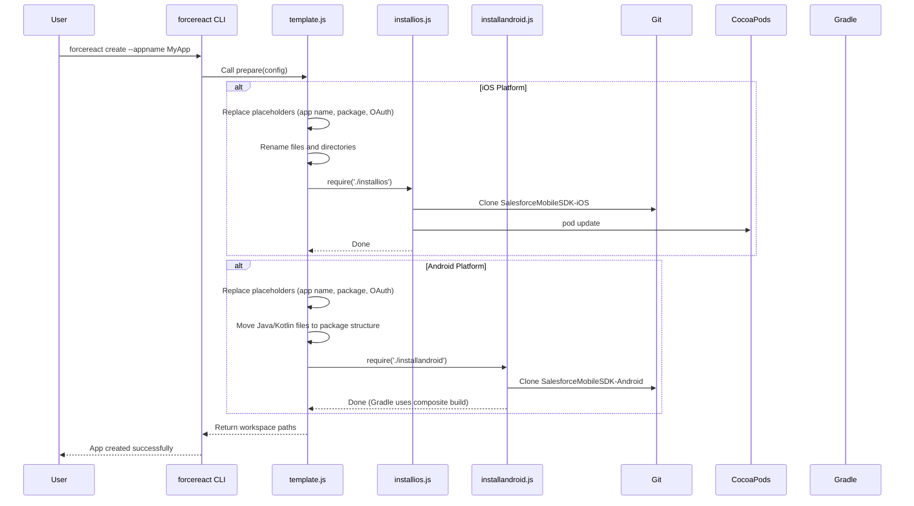

# React Native Templates Guide

This guide covers all React Native templates in the Salesforce Mobile SDK Templates repository.

> **API style note:** The `react-native-force` SDK uses **callback-based** APIs (`fn(args, successCallback, errorCallback)`). For Promise-based usage, wrap calls with `forceUtil.promiser(fn)`. Code examples in this guide use the actual callback style — examples elsewhere that show Promises should be treated as illustrative.

## Overview

The Salesforce Mobile SDK provides four React Native templates that serve different use cases:

| Template | Language | Use Case | Authentication |
|----------|----------|----------|----------------|
| **ReactNativeTemplate** | JavaScript | Basic starting point for React Native apps | Required on launch |
| **ReactNativeTypeScriptTemplate** | TypeScript | Type-safe React Native development | Required on launch |
| **ReactNativeDeferredTemplate** | JavaScript | Apps with guest mode / login-on-demand | Deferred (optional) |
| **MobileSyncExplorerReactNative** | JavaScript | Full sample app with offline sync | Required on launch |

## Choosing the Right Template

### Start with ReactNativeTemplate if:
- You're building a new app from scratch
- You prefer JavaScript over TypeScript
- Your app requires immediate authentication
- You want a minimal starting point to customize

### Use ReactNativeTypeScriptTemplate if:
- You want TypeScript's type safety and IDE support
- You're building a large-scale application
- Your team prefers strongly-typed code
- You need better refactoring and autocomplete

### Use ReactNativeDeferredTemplate if:
- Your app should work without immediate login
- You want to provide a "guest mode" or "try before login"
- Authentication should only happen when accessing Salesforce data
- Users should be able to log out and continue using the app

### Use MobileSyncExplorerReactNative if:
- You're learning the Mobile SDK and want a complete example
- You need to understand offline data synchronization
- You want to see CRUD operations with SmartStore
- You're building an app with similar offline-first requirements

## Quick Start

### Creating a New App

Using the Salesforce CLI tools:

```bash
# JavaScript template
forcereact create --appname MyApp --packagename com.mycompany.myapp --organization "My Company"

# TypeScript template
forcereact create --appname MyApp --packagename com.mycompany.myapp --organization "My Company" --templatename ReactNativeTypeScriptTemplate

# Deferred login template
forcereact create --appname MyApp --packagename com.mycompany.myapp --organization "My Company" --templatename ReactNativeDeferredTemplate

# Sample app (for learning)
forcereact create --appname MyApp --packagename com.mycompany.myapp --organization "My Company" --templatename MobileSyncExplorerReactNative
```

### Running the Generated App

**iOS:**
```bash
cd ios
pod install
cd ..
npm start
# In another terminal:
npm run ios
```

**Android:**
```bash
npm start
# In another terminal:
npm run android
```

## Template Structure

All React Native templates share a common structure:

```
<TemplateName>/
├── package.json                 # Dependencies and SDK references
├── template.js                  # Template customization script
├── installios.js                # iOS SDK installation
├── installandroid.js            # Android SDK installation
├── app.js or app.tsx            # Main React Native application
├── index.js                     # Entry point
├── metro.config.js              # Metro bundler configuration
├── babel.config.js              # Babel configuration
├── tsconfig.json                # TypeScript configuration (TS template only)
├── ios/                         # iOS native project
│   ├── Podfile                  # CocoaPods dependencies
│   ├── <AppName>.xcodeproj/     # Xcode project
│   └── <AppName>/               # iOS app directory
│       ├── AppDelegate.swift    # App lifecycle and SDK initialization
│       ├── bootconfig.plist     # OAuth configuration
│       └── Info.plist           # App metadata
└── android/                     # Android native project
    ├── build.gradle             # Root Gradle configuration
    ├── settings.gradle          # Project structure
    └── app/                     # Android app module
        ├── build.gradle         # App-level Gradle configuration
        └── src/main/
            ├── AndroidManifest.xml
            ├── java/            # Kotlin source files
            │   └── <package>/
            │       ├── MainActivity.kt
            │       └── MainApplication.kt
            └── res/             # Android resources
                ├── values/
                │   ├── bootconfig.xml
                │   └── strings.xml
                └── xml/
                    └── servers.xml
```

## Key Concepts

### Authentication Modes

**Immediate Authentication (Default):**
- App requires login before showing any content
- iOS: `AuthHelper.loginIfRequired()` in AppDelegate
- Android: `shouldAuthenticate() = true` in MainActivity
- Used by: ReactNativeTemplate, ReactNativeTypeScriptTemplate, MobileSyncExplorerReactNative

**Deferred Authentication:**
- App loads without requiring login
- User can explore the app as a guest
- Login only occurs when explicitly requested
- iOS: `AuthHelper.loginIfRequired()` still called, but app handles unauthenticated state
- Android: `shouldAuthenticate() = false` in MainActivity
- Used by: ReactNativeDeferredTemplate

### OAuth Configuration

OAuth settings are configured during app generation and stored in platform-specific files:

**iOS (bootconfig.plist):**
```xml
<key>remoteAccessConsumerKey</key>
<string>your-consumer-key</string>
<key>oauthRedirectURI</key>
<string>your-callback-url</string>
<key>shouldAuthenticate</key>
<true/>
```

**Android (bootconfig.xml):**
```xml
<string name="remoteAccessConsumerKey">your-consumer-key</string>
<string name="oauthRedirectURI">your-callback-url</string>
```

### SDK Dependencies

React Native templates depend on three SDK components:

1. **SalesforceMobileSDK-iOS** - iOS native SDK (Podfile reference)
2. **SalesforceMobileSDK-Android** - Android native SDK (Gradle composite build)
3. **SalesforceMobileSDK-ReactNative** - React Native bridge (npm package `react-native-force`)

These are specified in `package.json`:

```json
{
  "sdkDependencies": {
    "SalesforceMobileSDK-iOS": "https://github.com/forcedotcom/SalesforceMobileSDK-iOS.git#dev",
    "SalesforceMobileSDK-Android": "https://github.com/forcedotcom/SalesforceMobileSDK-Android.git#dev"
  },
  "dependencies": {
    "react-native-force": "git+https://github.com/forcedotcom/SalesforceMobileSDK-ReactNative.git#dev"
  }
}
```

### Template Generation Process

When you run `forcereact create`, the following happens:



## Common Tasks

### Customizing OAuth Settings

Edit the bootconfig files after generation:

**iOS:** `ios/<AppName>/bootconfig.plist`
**Android:** `android/app/src/main/res/values/bootconfig.xml`

### Changing Login Server

**iOS:** Edit `Info.plist` and change `SFDCDefaultLoginHost`
**Android:** Edit `android/app/src/main/res/xml/servers.xml`

### Adding New Screens

1. Create a new React component in your app
2. Use `@react-navigation/native-stack` or `@react-navigation/native` for navigation
3. All templates include React Navigation by default

### Accessing Salesforce Data

Use the `react-native-force` module. **The SDK uses callback-based APIs** (`success`, `error`):

```javascript
import { oauth, net, smartstore, mobilesync } from 'react-native-force';

// Execute SOQL query
net.query(
  'SELECT Id, Name FROM Contact LIMIT 10',
  (response) => { console.log('Records:', response.records); },
  (error) => { console.error(error); }
);

// Check authentication status
oauth.getAuthCredentials(
  (credentials) => { console.log('Access token:', credentials.accessToken); },
  (error) => { console.error(error); }
);
```

If you want to use Promises, wrap callback APIs with `forceUtil.promiser`:
```javascript
import { forceUtil } from 'react-native-force';
const query = forceUtil.promiser(net.query);
const records = (await query('SELECT Id FROM Contact')).records;
```

### Using SmartStore (Offline Storage)

```javascript
import { smartstore } from 'react-native-force';

// Register a soup (table)
smartstore.registerSoup(
  false, // isGlobalStore
  'contacts',
  [
    { path: 'Id', type: 'string' },
    { path: 'Name', type: 'string' }
  ],
  (soupName) => { /* success */ },
  (error) => { /* error */ }
);

// Query data
smartstore.querySoup(
  false,
  'contacts',
  { queryType: 'exact', indexPath: 'Id', matchKey: '001xx000003DGb0' },
  (cursor) => { /* success */ },
  (error) => { /* error */ }
);
```

### Using MobileSync (Offline Synchronization)

MobileSync is demonstrated in MobileSyncExplorerReactNative:

```javascript
import { mobilesync } from 'react-native-force';

// Sync down from Salesforce
mobilesync.syncDown(
  false, // isGlobalStore
  { type: 'soql', query: 'SELECT Id, Name FROM Contact LIMIT 100' }, // target
  'contacts', // soupName
  { mergeMode: mobilesync.MERGE_MODE.OVERWRITE }, // options
  'contactSync', // syncName
  (syncResult) => { /* success */ },
  (error) => { /* error */ }
);

// Sync up to Salesforce
mobilesync.syncUp(
  false, // isGlobalStore
  {}, // target (use empty {} for default)
  'contacts',
  { mergeMode: mobilesync.MERGE_MODE.OVERWRITE, fieldlist: ['Name', 'Email'] },
  null, // syncName
  (syncResult) => { /* success */ },
  (error) => { /* error */ }
);
```

## Testing React Native Templates

Use the `test_template.sh` script to validate templates:

```bash
# Test a specific template
./test_template.sh --template ReactNativeTemplate --platform ios

# Test with custom SDK branches
./test_template.sh \
  --template ReactNativeTemplate \
  --msdk-ios-branch my-feature \
  --msdk-android-branch my-feature \
  --rn-force-branch my-feature
```

See [TESTING.md](../../TESTING.md) for comprehensive testing documentation.

## Troubleshooting

### iOS Pod Install Fails

```bash
cd ios
rm -rf Pods Podfile.lock
pod install --repo-update
```

### Android Build Fails

```bash
cd android
./gradlew clean
cd ..
rm -rf android/.gradle
npm run android
```

### Metro Bundler Issues

```bash
npm start -- --reset-cache
```

### SDK Dependency Issues

```bash
# Delete SDK dependencies and reinstall
rm -rf mobile_sdk
node installios.js    # or installandroid.js
```

## Next Steps

- Read the individual template documentation for detailed information
- See [TEMPLATE_ANATOMY.md](./TEMPLATE_ANATOMY.md) for deep dive into template structure
- Review [ReactNativeTemplate.md](./ReactNativeTemplate.md), [ReactNativeTypeScriptTemplate.md](./ReactNativeTypeScriptTemplate.md), [ReactNativeDeferredTemplate.md](./ReactNativeDeferredTemplate.md), and [MobileSyncExplorerReactNative.md](./MobileSyncExplorerReactNative.md) for template-specific details
- Check the [Salesforce Mobile SDK Documentation](https://developer.salesforce.com/docs/platform/mobile-sdk/guide)

## Related Documentation

- [Main Templates README](../../README.md)
- [CLAUDE.md](../../CLAUDE.md) - AI development guidelines
- [TESTING.md](../../TESTING.md) - Template testing guide
- [SalesforceMobileSDK-ReactNative](https://github.com/forcedotcom/SalesforceMobileSDK-ReactNative) - React Native bridge repository
