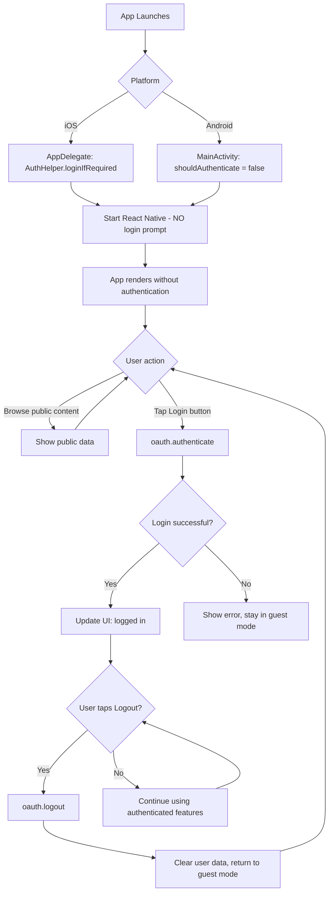

# ReactNativeDeferredTemplate

The deferred authentication React Native template for Salesforce Mobile SDK applications.

> **API style note:** The `react-native-force` SDK uses callback-based APIs (`fn(args, successCallback, errorCallback)`). Promise-style code in this guide is illustrative; use `forceUtil.promiser(fn)` for actual promise wrappers.

## Overview

`ReactNativeDeferredTemplate` demonstrates the **deferred authentication pattern**, where login is optional and happens on-demand rather than being required at app launch.

Key features:

- **JavaScript-based** React Native application
- **Deferred authentication** - login only when needed
- **Guest mode** - users can explore the app without logging in
- **Explicit login/logout** - user-initiated authentication
- **Cross-platform** support (iOS and Android)
- **Login-on-demand** - authenticate when accessing protected features

## When to Use This Template

Choose `ReactNativeDeferredTemplate` if:

- Your app should work without immediate authentication
- You want to provide a "guest mode" or "try before you buy" experience
- Authentication should only occur when accessing Salesforce data
- Users need to be able to log out and continue using the app
- Your app has both public and protected features

## Use Cases

### Example 1: News/Content App

```
App Launch → Show news articles (public)
User taps "Save to Salesforce" → Prompt for login
After login → Save article to Salesforce object
User can logout → Continue reading articles
```

### Example 2: Product Catalog

```
App Launch → Show product catalog (public)
User taps "Add to Cart" → Prompt for login
After login → Sync cart with Salesforce
User can logout → Continue browsing products
```

### Example 3: Learning App

```
App Launch → Show course list (public)
User taps "Enroll" → Prompt for login
After login → Track progress in Salesforce
User can logout → Continue viewing courses
```

## Not the Right Fit?

- **Need authentication on launch?** → Use [ReactNativeTemplate](./ReactNativeTemplate.md)
- **Want TypeScript?** → No deferred TypeScript template yet (create one!)
- **Learning the SDK?** → Use [MobileSyncExplorerReactNative](./MobileSyncExplorerReactNative.md)

## Creating an App from This Template

### Using the CLI

```bash
forcereact create \
  --appname MyApp \
  --packagename com.mycompany.myapp \
  --organization "My Company" \
  --templatename ReactNativeDeferredTemplate
```

### With OAuth Configuration

```bash
forcereact create \
  --appname MyApp \
  --packagename com.mycompany.myapp \
  --organization "My Company" \
  --templatename ReactNativeDeferredTemplate \
  --consumerkey "3MVG9..." \
  --callbackurl "myapp://oauth/callback"
```

## Authentication Pattern Comparison

| Feature | Standard Templates | ReactNativeDeferredTemplate |
|---------|-------------------|----------------------------|
| **Launch behavior** | Require login immediately | No login required |
| **Initial screen** | OAuth login screen | App content |
| **Authentication trigger** | Automatic on launch | User taps "Login" button |
| **Guest mode** | Not supported | Fully supported |
| **Logout** | Rare (usually stays logged in) | Common (users switch between modes) |
| **API calls before login** | Not possible | Fail gracefully, prompt login |

## Deferred Authentication Flow



## Key Differences from Standard Template

### iOS: AppDelegate.swift

**Standard Template:**
```swift
// User MUST log in before React Native starts
AuthHelper.loginIfRequired() {
  factory.startReactNative(
    withModuleName: "MyApp",
    in: self.window,
    launchOptions: launchOptions
  )
}
```

**Deferred Template:**
```swift
// React Native starts immediately, login happens later if needed
// (Same code, but behavior changes based on how React Native handles it)
AuthHelper.loginIfRequired() {
  factory.startReactNative(
    withModuleName: "ReactNativeDeferredTemplate",
    in: self.window,
    launchOptions: launchOptions
  )
}
```

Note: iOS uses the same AppDelegate code. The deferred behavior is implemented in React Native JavaScript.

### Android: MainActivity.kt

**Standard Template:**
```kotlin
override fun shouldAuthenticate() = true  // Require login on launch
```

**Deferred Template:**
```kotlin
override fun shouldAuthenticate() = false  // NO login required on launch
```

This is the critical difference for Android - setting `shouldAuthenticate()` to `false` allows the app to start without authentication.

### React Native: app.js

**Standard Template:**
```javascript
componentDidMount() {
  // Assumes user is already authenticated
  oauth.getAuthCredentials()
    .then(() => this.fetchData())
    .catch(error => console.error(error));
}
```

**Deferred Template:**
```javascript
componentDidMount() {
  // Check auth status, but don't require it
  this.checkAuthStatus();
}

checkAuthStatus = () => {
  oauth.getAuthCredentials()
    .then(credentials => {
      this.setState({ authenticated: true, credentials });
    })
    .catch(() => {
      // User not authenticated - that's OK!
      this.setState({ authenticated: false });
    });
}

login = () => {
  oauth.authenticate()
    .then(credentials => {
      this.setState({ authenticated: true, credentials });
    })
    .catch(error => {
      console.error('Login failed:', error);
    });
}

logout = () => {
  oauth.logout();
  this.setState({ authenticated: false, credentials: null });
}
```

## Project Structure

Same as [ReactNativeTemplate](./ReactNativeTemplate.md) with these key file differences:

```
MyApp/
├── app.js                       # Deferred auth logic
├── ios/
│   └── MyApp/
│       └── AppDelegate.swift    # Same as standard template
└── android/
    └── app/src/main/java/
        └── MainActivity.kt      # shouldAuthenticate() = false
```

## Implementation Guide

### Complete app.js Example

```javascript
import React from 'react';
import {
  StyleSheet,
  Text,
  View,
  FlatList,
  Button,
  ActivityIndicator,
  TouchableOpacity,
} from 'react-native';

import { NavigationContainer } from '@react-navigation/native';
import { createNativeStackNavigator } from '@react-navigation/native-stack';
import { oauth, net } from 'react-native-force';

const Stack = createNativeStackNavigator();

export default class App extends React.Component {
  state = {
    authenticated: false,
    credentials: null,
    records: [],
    loading: false,
    error: null,
  };

  componentDidMount() {
    this.checkAuthStatus();
  }

  checkAuthStatus = () => {
    oauth.getAuthCredentials()
      .then(credentials => {
        console.log('User is authenticated');
        this.setState({ authenticated: true, credentials });
      })
      .catch(() => {
        console.log('User is not authenticated - guest mode');
        this.setState({ authenticated: false });
      });
  }

  login = () => {
    this.setState({ loading: true, error: null });
    
    oauth.authenticate()
      .then(credentials => {
        this.setState({ 
          authenticated: true, 
          credentials,
          loading: false 
        });
      })
      .catch(error => {
        console.error('Login failed:', error);
        this.setState({ 
          error: 'Login failed. Please try again.',
          loading: false 
        });
      });
  }

  logout = () => {
    oauth.logout();
    this.setState({ 
      authenticated: false, 
      credentials: null,
      records: [],
      error: null 
    });
  }

  fetchData = () => {
    if (!this.state.authenticated) {
      this.setState({ error: 'Please login to view data' });
      return;
    }

    this.setState({ loading: true, error: null });

    net.query('SELECT Id, Name FROM Account LIMIT 10')
      .then(response => {
        this.setState({ 
          records: response.records,
          loading: false 
        });
      })
      .catch(error => {
        console.error('Query failed:', error);
        this.setState({ 
          error: 'Failed to fetch data',
          loading: false 
        });
      });
  }

  render() {
    return (
      <NavigationContainer>
        <Stack.Navigator>
          <Stack.Screen name="Home">
            {props => <HomeScreen {...props} {...this.state} {...this} />}
          </Stack.Screen>
        </Stack.Navigator>
      </NavigationContainer>
    );
  }
}

function HomeScreen({ authenticated, credentials, records, loading, error, login, logout, fetchData }) {
  return (
    <View style={styles.container}>
      <Text style={styles.header}>Deferred Auth Demo</Text>

      {loading && <ActivityIndicator size="large" />}
      
      {error && <Text style={styles.error}>{error}</Text>}

      {authenticated ? (
        <View>
          <Text style={styles.status}>Logged in as: {credentials?.userId}</Text>
          
          <Button title="Fetch Salesforce Data" onPress={fetchData} />
          <Button title="Logout" onPress={logout} color="red" />

          {records.length > 0 && (
            <FlatList
              data={records}
              keyExtractor={item => item.Id}
              renderItem={({ item }) => (
                <Text style={styles.record}>{item.Name}</Text>
              )}
            />
          )}
        </View>
      ) : (
        <View>
          <Text style={styles.status}>Guest Mode</Text>
          <Text style={styles.info}>
            You can browse the app without logging in.
            Tap Login to access Salesforce data.
          </Text>
          <Button title="Login to Salesforce" onPress={login} />
        </View>
      )}
    </View>
  );
}

const styles = StyleSheet.create({
  container: { flex: 1, padding: 20 },
  header: { fontSize: 24, fontWeight: 'bold', marginBottom: 20 },
  status: { fontSize: 18, marginBottom: 10 },
  info: { fontSize: 14, color: '#666', marginBottom: 20 },
  error: { color: 'red', marginBottom: 10 },
  record: { padding: 10, borderBottomWidth: 1, borderColor: '#ccc' },
});
```

### Protecting Features That Require Authentication

```javascript
function ProtectedFeature() {
  const [authenticated, setAuthenticated] = useState(false);

  useEffect(() => {
    checkAuth();
  }, []);

  async function checkAuth() {
    try {
      await oauth.getAuthCredentials();
      setAuthenticated(true);
    } catch {
      setAuthenticated(false);
    }
  }

  async function tryFetchData() {
    if (!authenticated) {
      // Prompt for login
      try {
        await oauth.authenticate();
        setAuthenticated(true);
        // Now fetch data
        const response = await net.query('SELECT Id, Name FROM Account');
        return response.records;
      } catch (error) {
        Alert.alert('Login Required', 'Please login to access this feature');
        return [];
      }
    } else {
      // User already authenticated, fetch directly
      const response = await net.query('SELECT Id, Name FROM Account');
      return response.records;
    }
  }

  return (
    <View>
      {authenticated ? (
        <Text>You have access to protected features</Text>
      ) : (
        <Text>Login required for protected features</Text>
      )}
      <Button title="Load Data" onPress={tryFetchData} />
    </View>
  );
}
```

### Graceful API Failure Handling

```javascript
async function fetchWithAuth(soql) {
  try {
    // Try to fetch data
    const response = await net.query(soql);
    return { success: true, data: response.records };
  } catch (error) {
    // Check if error is auth-related
    if (error.message?.includes('authentication') || error.message?.includes('unauthorized')) {
      // Prompt user to login
      try {
        await oauth.authenticate();
        // Retry the query
        const response = await net.query(soql);
        return { success: true, data: response.records };
      } catch (loginError) {
        return { success: false, error: 'Login failed', needsAuth: true };
      }
    } else {
      return { success: false, error: error.message };
    }
  }
}

// Usage
const result = await fetchWithAuth('SELECT Id, Name FROM Account');
if (result.success) {
  console.log('Data:', result.data);
} else if (result.needsAuth) {
  Alert.alert('Login Required', 'Please login to access this data');
} else {
  Alert.alert('Error', result.error);
}
```

## User Experience Best Practices

### 1. Clear Status Indicators

Show users whether they're logged in or in guest mode:

```javascript
function StatusBar({ authenticated, credentials }) {
  return (
    <View style={styles.statusBar}>
      {authenticated ? (
        <View style={styles.authenticatedStatus}>
          <Icon name="check-circle" color="green" />
          <Text>Logged in as {credentials.userId}</Text>
        </View>
      ) : (
        <View style={styles.guestStatus}>
          <Icon name="user" color="gray" />
          <Text>Guest Mode</Text>
        </View>
      )}
    </View>
  );
}
```

### 2. Progressive Feature Access

Show what features require authentication:

```javascript
function FeatureList({ authenticated }) {
  const features = [
    { name: 'Browse Products', requiresAuth: false },
    { name: 'Save Favorites', requiresAuth: true },
    { name: 'View Order History', requiresAuth: true },
    { name: 'Contact Support', requiresAuth: false },
  ];

  return (
    <FlatList
      data={features}
      renderItem={({ item }) => (
        <View style={styles.feature}>
          <Text>{item.name}</Text>
          {item.requiresAuth && !authenticated && (
            <Text style={styles.lockIcon}>🔒 Login required</Text>
          )}
        </View>
      )}
    />
  );
}
```

### 3. Contextual Login Prompts

Prompt for login at the right moment:

```javascript
function SaveButton({ authenticated, onSave }) {
  async function handlePress() {
    if (!authenticated) {
      Alert.alert(
        'Login Required',
        'You need to login to save this item.',
        [
          { text: 'Cancel', style: 'cancel' },
          { text: 'Login', onPress: async () => {
            try {
              await oauth.authenticate();
              await onSave();
            } catch (error) {
              Alert.alert('Login Failed', error.message);
            }
          }}
        ]
      );
    } else {
      await onSave();
    }
  }

  return <Button title="Save" onPress={handlePress} />;
}
```

### 4. Preserve User Context on Logout

Don't lose the user's place in the app:

```javascript
function logout() {
  Alert.alert(
    'Logout',
    'Are you sure you want to logout? You can continue using the app in guest mode.',
    [
      { text: 'Cancel', style: 'cancel' },
      { text: 'Logout', style: 'destructive', onPress: () => {
        oauth.logout();
        // Clear auth-related state but keep navigation state
        setAuthenticated(false);
        setCredentials(null);
        // User stays on current screen
      }}
    ]
  );
}
```

## Testing

### Test Scenarios

1. **Launch without authentication**
   - App should load normally
   - Guest mode features should work
   - Protected features should prompt for login

2. **Login from guest mode**
   - Tap login button
   - Complete OAuth flow
   - App should update to show authenticated state
   - Protected features should now work

3. **Logout from authenticated mode**
   - Tap logout button
   - App should return to guest mode
   - Protected features should no longer work
   - Guest mode features should still work

4. **API calls before login**
   - Attempt to fetch Salesforce data without logging in
   - Should fail gracefully
   - Should prompt for login
   - After login, should retry and succeed

5. **Session expiration**
   - Login and use app
   - Let session expire (or revoke token in Salesforce Setup)
   - Attempt protected action
   - Should detect expired session and prompt for re-login

### Manual Testing Script

```
1. Launch app
   ✓ App loads without login screen
   ✓ Shows "Guest Mode" status

2. Browse guest features
   ✓ Can navigate between screens
   ✓ Can view public content

3. Try protected feature
   ✓ Shows login prompt
   ✓ Can cancel and stay in guest mode

4. Login
   ✓ OAuth screen appears
   ✓ After login, returns to app
   ✓ Shows "Logged in" status
   ✓ Protected features now work

5. Use protected features
   ✓ Can fetch Salesforce data
   ✓ Can create/update records
   ✓ Can use SmartStore

6. Logout
   ✓ Returns to guest mode
   ✓ Protected features no longer work
   ✓ Guest features still work

7. Login again
   ✓ Can login again after logout
   ✓ All features work as before
```

## Common Patterns

### Remember Authentication State

```javascript
import AsyncStorage from '@react-native-async-storage/async-storage';

async function rememberAuth(authenticated) {
  await AsyncStorage.setItem('wasAuthenticated', authenticated.toString());
}

async function checkPreviousAuth() {
  const wasAuth = await AsyncStorage.getItem('wasAuthenticated');
  return wasAuth === 'true';
}

// On app launch
async componentDidMount() {
  const wasAuthenticated = await checkPreviousAuth();
  if (wasAuthenticated) {
    // Try to restore session
    try {
      const credentials = await oauth.getAuthCredentials();
      this.setState({ authenticated: true, credentials });
    } catch {
      // Session expired, clear flag
      await rememberAuth(false);
    }
  }
}
```

### Conditional Navigation

```javascript
function MainNavigator({ authenticated }) {
  return (
    <Stack.Navigator>
      <Stack.Screen name="Home" component={HomeScreen} />
      <Stack.Screen name="Browse" component={BrowseScreen} />
      
      {authenticated ? (
        <>
          <Stack.Screen name="Favorites" component={FavoritesScreen} />
          <Stack.Screen name="Profile" component={ProfileScreen} />
        </>
      ) : (
        <Stack.Screen name="Login" component={LoginScreen} />
      )}
    </Stack.Navigator>
  );
}
```

### Auth-Aware Components

```javascript
function withAuth(Component) {
  return function AuthAwareComponent(props) {
    const [authenticated, setAuthenticated] = useState(false);

    useEffect(() => {
      oauth.getAuthCredentials()
        .then(() => setAuthenticated(true))
        .catch(() => setAuthenticated(false));
    }, []);

    return <Component {...props} authenticated={authenticated} />;
  };
}

// Usage
const AuthAwareScreen = withAuth(MyScreen);
```

## Troubleshooting

### App Still Requires Login on Launch (Android)

**Problem:** Android app shows OAuth screen immediately despite using deferred template.

**Solution:** Check `MainActivity.kt`:

```kotlin
override fun shouldAuthenticate() = false  // Must be false!
```

### iOS Shows Login Screen Immediately

**Problem:** iOS app requires login on launch.

**Cause:** The iOS SDK doesn't have a `shouldAuthenticate` setting. Authentication behavior is controlled by React Native code.

**Solution:** Make sure `app.js` doesn't call `oauth.authenticate()` in `componentDidMount()`. It should only call `oauth.getAuthCredentials()` and handle the error gracefully.

### API Calls Fail Silently

**Problem:** Calls to `net.query()` fail without showing login prompt.

**Solution:** Add proper error handling:

```javascript
try {
  const response = await net.query('SELECT Id FROM Account');
  return response.records;
} catch (error) {
  if (!authenticated) {
    // Prompt for login
    await oauth.authenticate();
    // Retry
    const response = await net.query('SELECT Id FROM Account');
    return response.records;
  } else {
    throw error;
  }
}
```

## Next Steps

- Read [TEMPLATE_ANATOMY.md](./TEMPLATE_ANATOMY.md) for template internals
- Review [ReactNativeTemplate](./ReactNativeTemplate.md) for standard authentication
- Explore [MobileSyncExplorerReactNative.md](./MobileSyncExplorerReactNative.md) for offline patterns
- Check [Salesforce Mobile SDK Documentation](https://developer.salesforce.com/docs/platform/mobile-sdk/guide)

## Related Resources

- [OAuth 2.0 User-Agent Flow](https://help.salesforce.com/articleView?id=remoteaccess_oauth_user_agent_flow.htm)
- [React Native Documentation](https://reactnative.dev/)
- [SalesforceMobileSDK-ReactNative Repository](https://github.com/forcedotcom/SalesforceMobileSDK-ReactNative)
