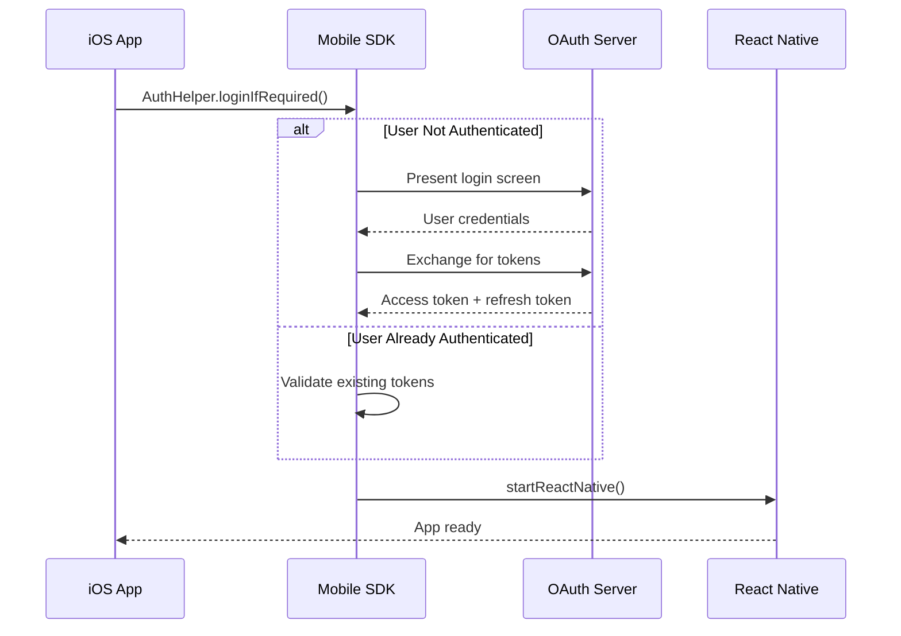
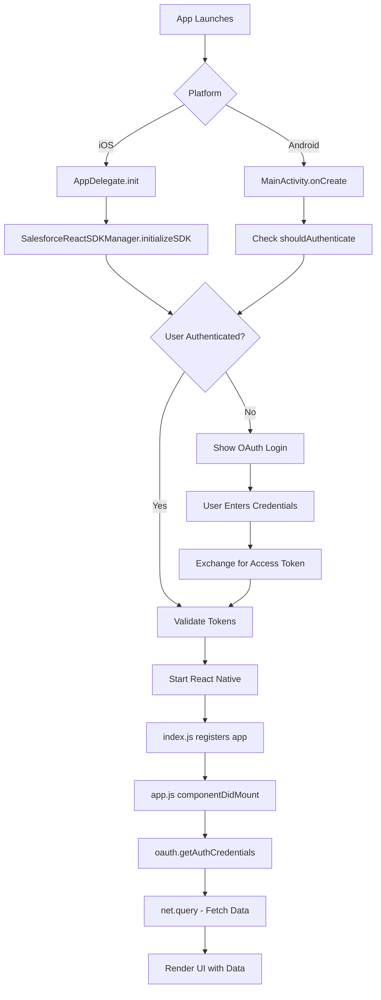
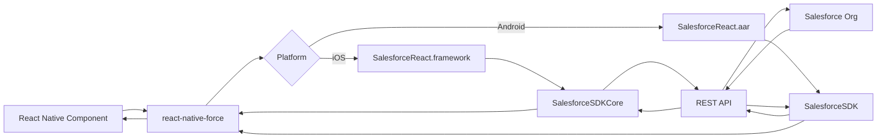

# ReactNativeTemplate

The basic JavaScript React Native template for Salesforce Mobile SDK applications.

## Overview

`ReactNativeTemplate` is the default starting point for creating React Native apps with the Salesforce Mobile SDK. It provides:

- **JavaScript-based** React Native application
- **Immediate authentication** on app launch
- **Cross-platform** support (iOS and Android)
- **Sample SOQL query** and data display
- **React Navigation** for multi-screen apps
- **Mobile SDK integration** with `react-native-force`

## When to Use This Template

Choose `ReactNativeTemplate` if:

- You're starting a new React Native app from scratch
- You prefer JavaScript over TypeScript
- Your app requires users to authenticate before accessing any features
- You want a minimal, clean starting point to build upon
- You're familiar with React Native and want Mobile SDK integration

## Not the Right Fit?

- **Want TypeScript?** → Use [ReactNativeTypeScriptTemplate](./ReactNativeTypeScriptTemplate.md)
- **Need guest mode?** → Use [ReactNativeDeferredTemplate](./ReactNativeDeferredTemplate.md)
- **Learning the SDK?** → Use [MobileSyncExplorerReactNative](./MobileSyncExplorerReactNative.md)

## Creating an App from This Template

### Using the CLI

```bash
forcereact create \
  --appname MyApp \
  --packagename com.mycompany.myapp \
  --organization "My Company"
```

### With OAuth Configuration

```bash
forcereact create \
  --appname MyApp \
  --packagename com.mycompany.myapp \
  --organization "My Company" \
  --consumerkey "3MVG9..." \
  --callbackurl "myapp://oauth/callback"
```

### Specifying Platforms

```bash
# iOS only
forcereact create --appname MyApp --packagename com.mycompany.myapp --platform ios

# Android only
forcereact create --appname MyApp --packagename com.mycompany.myapp --platform android

# Both (default)
forcereact create --appname MyApp --packagename com.mycompany.myapp --platform ios,android
```

## Project Structure

```
MyApp/
├── package.json                 # Dependencies and SDK references
├── app.js                       # Main application code (CUSTOMIZE THIS)
├── index.js                     # React Native entry point
├── metro.config.js              # Metro bundler configuration
├── babel.config.js              # Babel configuration
├── .eslintrc.js                 # ESLint rules
├── .prettierrc.js               # Code formatting rules
├── mobile_sdk/                  # Cloned SDK repositories (gitignored)
│   ├── SalesforceMobileSDK-iOS/
│   └── SalesforceMobileSDK-Android/
├── ios/                         # iOS native project
│   ├── Podfile                  # CocoaPods dependencies
│   ├── MyApp.xcworkspace        # Open this in Xcode
│   ├── MyApp.xcodeproj/         # Xcode project
│   └── MyApp/
│       ├── AppDelegate.swift    # iOS app lifecycle
│       ├── bootconfig.plist     # OAuth configuration
│       └── Info.plist           # App metadata
└── android/                     # Android native project
    ├── settings.gradle          # Composite build configuration
    ├── app/
    │   ├── build.gradle         # App dependencies
    │   └── src/main/
    │       ├── AndroidManifest.xml
    │       ├── java/com/mycompany/myapp/
    │       │   ├── MainActivity.kt
    │       │   └── MainApplication.kt
    │       └── res/
    │           ├── values/
    │           │   └── bootconfig.xml  # OAuth configuration
    │           └── xml/
    │               └── servers.xml     # Login servers
```

## Key Files

### app.js

The main application code. This is where you'll spend most of your time customizing.

**Default implementation:**

```javascript
import React from 'react';
import {
    StyleSheet,
    Text,
    View,
    FlatList,
    ActivityIndicator,
    TouchableOpacity,
} from 'react-native';

import { NavigationContainer } from '@react-navigation/native';
import { createStackNavigator } from '@react-navigation/stack';
import { oauth, net } from 'react-native-force';

const Stack = createStackNavigator();

export default class App extends React.Component {
  state = {
    authenticated: false,
    records: []
  };

  componentDidMount() {
    // Authenticate and fetch data
    oauth.getAuthCredentials()
      .then(credentials => {
        this.setState({ authenticated: true });
        return net.query('SELECT Id, Name FROM Account LIMIT 10');
      })
      .then(response => {
        this.setState({ records: response.records });
      })
      .catch(error => {
        console.error('Error:', error);
      });
  }

  render() {
    return (
      <NavigationContainer>
        <Stack.Navigator>
          <Stack.Screen name="Home" component={HomeScreen} />
          <Stack.Screen name="Details" component={DetailsScreen} />
        </Stack.Navigator>
      </NavigationContainer>
    );
  }
}
```

**Key points:**

- `oauth.getAuthCredentials()` - Verify authentication
- `net.query()` - Execute SOQL queries
- React Navigation for multi-screen navigation
- Component-based architecture

### iOS Configuration

#### AppDelegate.swift

Initializes the Mobile SDK and handles authentication.

```swift
import SalesforceReact
import SalesforceSDKCore

@main
class AppDelegate: UIResponder, UIApplicationDelegate {
  override init() {
    super.init()
    SalesforceReactSDKManager.initializeSDK()
  }
  
  func application(
    _ application: UIApplication,
    didFinishLaunchingWithOptions launchOptions: [UIApplication.LaunchOptionsKey: Any]? = nil
  ) -> Bool {
    // ... setup code ...
    
    // Authenticate before starting React Native
    AuthHelper.loginIfRequired() {
      factory.startReactNative(
        withModuleName: "MyApp",
        in: self.window,
        launchOptions: launchOptions
      )
    }
    
    return true
  }
}
```

**Authentication flow:**



#### bootconfig.plist

OAuth configuration for the app.

```xml
<?xml version="1.0" encoding="UTF-8"?>
<!DOCTYPE plist PUBLIC "-//Apple//DTD PLIST 1.0//EN" "http://www.apple.com/DTDs/PropertyList-1.0.dtd">
<plist version="1.0">
<dict>
    <key>remoteAccessConsumerKey</key>
    <string>3MVG9...</string>
    <key>oauthRedirectURI</key>
    <string>myapp://oauth/callback</string>
    <key>shouldAuthenticate</key>
    <true/>
</dict>
</plist>
```

**To update after generation:**

1. Open `ios/MyApp/bootconfig.plist` in Xcode or text editor
2. Replace `remoteAccessConsumerKey` with your Connected App's consumer key
3. Replace `oauthRedirectURI` with your callback URL

#### Podfile

Defines CocoaPods dependencies.

```ruby
require_relative '../mobile_sdk/SalesforceMobileSDK-iOS/mobilesdk_pods'

platform :ios, '18.0'
prepare_react_native_project!

target 'MyApp' do
  config = use_native_modules!
  use_frameworks! :linkage => :static

  # React Native core
  use_react_native!(
    :path => config[:reactNativePath],
    :app_path => "#{Pod::Config.instance.installation_root}/.."
  )

  # Mobile SDK libraries
  use_mobile_sdk!(:path => '../mobile_sdk/SalesforceMobileSDK-iOS')
  
  # React Native bridge
  pod 'SalesforceReact', :path => '../node_modules/react-native-force'

  post_install do |installer|
    react_native_post_install(installer, config[:reactNativePath])
    mobile_sdk_post_install(installer)
  end
end
```

### Android Configuration

#### MainActivity.kt

Main activity for the React Native app.

```kotlin
package com.mycompany.myapp

import android.os.Bundle
import com.facebook.react.ReactActivityDelegate
import com.facebook.react.defaults.DefaultNewArchitectureEntryPoint.fabricEnabled
import com.facebook.react.defaults.DefaultReactActivityDelegate
import com.salesforce.androidsdk.reactnative.ui.SalesforceReactActivity

class MainActivity : SalesforceReactActivity() {

    override fun onCreate(savedInstanceState: Bundle?) {
        super.onCreate(null) // react-native-screens requires null
    }

    override fun getMainComponentName() = "MyApp"

    override fun createReactActivityDelegate() = 
        DefaultReactActivityDelegate(this, mainComponentName, fabricEnabled)

    // Require authentication on app launch
    override fun shouldAuthenticate() = true
}
```

**Key method:**

- `shouldAuthenticate() = true` - Requires authentication before showing React Native content
- Change to `false` for deferred authentication (see ReactNativeDeferredTemplate)

#### bootconfig.xml

OAuth configuration for Android.

```xml
<?xml version="1.0" encoding="utf-8"?>
<resources>
    <string name="remoteAccessConsumerKey">3MVG9...</string>
    <string name="oauthRedirectURI">myapp://oauth/callback</string>
</resources>
```

**Location:** `android/app/src/main/res/values/bootconfig.xml`

#### settings.gradle

Configures Gradle composite build to use the cloned Android SDK.

```gradle
includeBuild('../mobile_sdk/SalesforceMobileSDK-Android') {
    dependencySubstitution {
        substitute(module('com.salesforce.mobilesdk:SalesforceSDK'))
            .using project(':libs:SalesforceSDK')
        substitute(module('com.salesforce.mobilesdk:SalesforceReact'))
            .using project(':libs:SalesforceReact')
    }
}
```

## Running the App

### iOS

```bash
# Install dependencies
npm install
cd ios && pod install && cd ..

# Start Metro bundler
npm start

# In another terminal, run on iOS
npm run ios

# Or open in Xcode
open ios/MyApp.xcworkspace
# Then click Run button
```

### Android

```bash
# Install dependencies
npm install

# Start Metro bundler
npm start

# In another terminal, run on Android
npm run android

# Or open in Android Studio
# File > Open > select android/ directory
# Then click Run button
```

## Customization Guide

### Changing the SOQL Query

Edit `app.js` and modify the query in `componentDidMount()`:

```javascript
componentDidMount() {
  oauth.getAuthCredentials()
    .then(() => {
      // Change this query to fetch your data
      return net.query('SELECT Id, Name, Industry FROM Account ORDER BY Name LIMIT 50');
    })
    .then(response => {
      this.setState({ records: response.records });
    });
}
```

### Adding New Screens

1. Create a new component:

```javascript
// ContactScreen.js
import React from 'react';
import { View, Text, StyleSheet } from 'react-native';

export default function ContactScreen({ route }) {
  const { contactId } = route.params;
  
  return (
    <View style={styles.container}>
      <Text>Contact ID: {contactId}</Text>
    </View>
  );
}

const styles = StyleSheet.create({
  container: { flex: 1, padding: 20 }
});
```

2. Add to navigation in `app.js`:

```javascript
<Stack.Navigator>
  <Stack.Screen name="Home" component={HomeScreen} />
  <Stack.Screen name="Contact" component={ContactScreen} />
</Stack.Navigator>
```

3. Navigate to the screen:

```javascript
navigation.navigate('Contact', { contactId: '003...' });
```

### Using SmartStore for Offline Storage

```javascript
import { smartstore } from 'react-native-force';

// Register a soup (table)
smartstore.registerSoup(
  false, // isGlobalStore
  'accounts', // soupName
  [ // indexes
    { path: 'Id', type: 'string' },
    { path: 'Name', type: 'full_text' }
  ]
).then(() => {
  // Store records
  return smartstore.upsertSoupEntries(
    false,
    'accounts',
    [
      { Id: '001...', Name: 'Acme Corp', _soupEntryId: 1 },
      { Id: '001...', Name: 'Global Inc', _soupEntryId: 2 }
    ]
  );
});

// Query data
smartstore.querySoup(
  false,
  'accounts',
  { queryType: 'match', path: 'Name', matchKey: 'Acme', order: 'ascending' }
).then(result => {
  console.log('Records:', result.currentPageOrderedEntries);
});
```

### Handling Logout

```javascript
import { oauth } from 'react-native-force';

function logout() {
  oauth.logout();
  // App will restart and show login screen
}
```

### Fetching User Info

```javascript
import { oauth } from 'react-native-force';

oauth.getAuthCredentials().then(credentials => {
  console.log('User ID:', credentials.userId);
  console.log('Org ID:', credentials.orgId);
  console.log('Instance URL:', credentials.instanceUrl);
  console.log('Access Token:', credentials.accessToken);
});
```

## Application Flow



## Data Flow



## Common Issues

### iOS: Pod Install Fails

**Error:** `Unable to find a specification for...`

**Solution:**
```bash
cd ios
rm -rf Pods Podfile.lock
pod install --repo-update
```

### Android: Gradle Build Fails

**Error:** `Could not resolve com.salesforce.mobilesdk:SalesforceReact`

**Solution:**
```bash
# Ensure mobile_sdk directory exists
ls mobile_sdk/SalesforceMobileSDK-Android

# If missing, run:
node installandroid.js
```

### Metro Bundler: Module Not Found

**Error:** `Unable to resolve module react-native-force`

**Solution:**
```bash
# Clear cache and reinstall
rm -rf node_modules package-lock.json
npm install
npm start -- --reset-cache
```

### Authentication Loop

**Symptom:** App keeps showing login screen repeatedly

**Causes & Solutions:**

1. **Invalid OAuth configuration**
   - Check `bootconfig.plist` (iOS) or `bootconfig.xml` (Android)
   - Ensure consumer key and callback URL match your Connected App

2. **Callback URL not registered**
   - Add callback URL to URL Schemes in Xcode (iOS)
   - Add callback URL to AndroidManifest.xml intent filter (Android)

3. **Connected App not configured**
   - Verify OAuth settings in Salesforce Setup
   - Enable "Refresh Token" policy

## Testing

### Manual Testing

1. **Launch and authenticate**
   - App should show OAuth login screen
   - After login, should show data from SOQL query

2. **Test offline behavior**
   - Login and let data load
   - Enable airplane mode
   - Force-quit and restart app
   - Should re-authenticate using refresh token

3. **Test logout**
   - Add logout button (see Customization Guide)
   - Logout should clear tokens and return to login screen

### Automated Testing

Run Jest tests:

```bash
npm test
```

### Template Testing

Test the template itself with `test_template.sh`:

```bash
cd /path/to/SalesforceMobileSDK-Templates

# Test iOS
./test_template.sh --template ReactNativeTemplate --platform ios

# Test Android
./test_template.sh --template ReactNativeTemplate --platform android

# Test with custom SDK branch
./test_template.sh \
  --template ReactNativeTemplate \
  --msdk-ios-branch my-feature \
  --platform ios
```

## Next Steps

### Learn More

- Read [TEMPLATE_ANATOMY.md](./TEMPLATE_ANATOMY.md) for deep dive into template structure
- Review [MobileSyncExplorerReactNative.md](./MobileSyncExplorerReactNative.md) for offline sync patterns
- Check [Salesforce Mobile SDK Documentation](https://developer.salesforce.com/docs/platform/mobile-sdk/guide)

### Add Features

- Implement CRUD operations (Create, Read, Update, Delete)
- Add offline storage with SmartStore
- Implement offline sync with MobileSync
- Add push notifications
- Implement biometric authentication
- Add custom login screen

### Related Templates

- [ReactNativeTypeScriptTemplate](./ReactNativeTypeScriptTemplate.md) - TypeScript version
- [ReactNativeDeferredTemplate](./ReactNativeDeferredTemplate.md) - Guest mode / login on demand
- [MobileSyncExplorerReactNative](./MobileSyncExplorerReactNative.md) - Full sample with offline sync

## Additional Resources

- [React Native Documentation](https://reactnative.dev/)
- [React Navigation Documentation](https://reactnavigation.org/)
- [Salesforce REST API](https://developer.salesforce.com/docs/atlas.en-us.api_rest.meta/api_rest/)
- [SalesforceMobileSDK-ReactNative Repository](https://github.com/forcedotcom/SalesforceMobileSDK-ReactNative)
