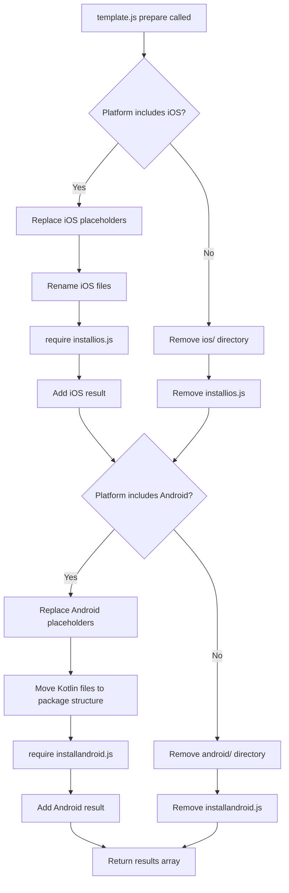
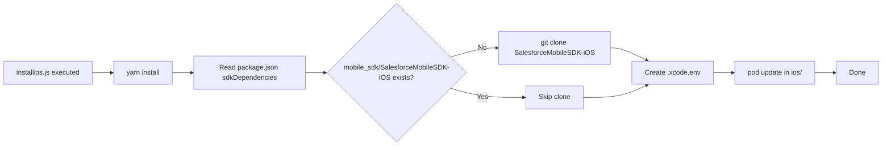
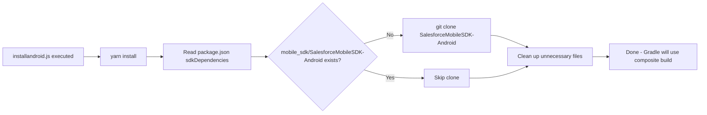
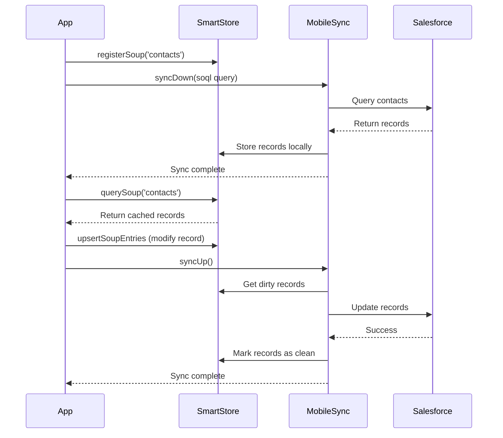

# React Native Template Anatomy

This document provides a deep dive into the structure and mechanics of React Native templates in the Salesforce Mobile SDK.

## Overview

React Native templates are **cross-platform** templates that generate both iOS and Android native projects with a shared React Native JavaScript/TypeScript codebase. Understanding the template anatomy is essential for:

- Creating new React Native templates
- Customizing existing templates
- Debugging template generation issues
- Testing templates with custom SDK branches

## Template Directory Structure

```
ReactNativeTemplate/
├── package.json                 # SDK dependencies and npm packages
├── template.js                  # Template customization script (MOST IMPORTANT)
├── installios.js                # iOS SDK installation script
├── installandroid.js            # Android SDK installation script
├── app.js                       # Main React Native application code
├── index.js                     # React Native entry point
├── metro.config.js              # Metro bundler configuration
├── babel.config.js              # Babel transpiler configuration
├── jest.config.js               # Jest test configuration
├── tsconfig.json                # TypeScript configuration (TypeScript templates only)
├── .eslintrc.js                 # ESLint configuration
├── .prettierrc.js               # Prettier configuration
├── .watchmanconfig              # Watchman configuration
├── Gemfile                      # Ruby dependencies (CocoaPods)
├── ios/                         # iOS native project (see below)
└── android/                     # Android native project (see below)
```

## Core Template Files

### package.json

Defines SDK dependencies and npm packages.

**Key sections:**

```json
{
  "name": "ReactNativeTemplate",
  "version": "0.0.1",
  "private": true,
  
  "scripts": {
    "android": "react-native run-android",
    "ios": "react-native run-ios",
    "start": "react-native start"
  },
  
  "sdkDependencies": {
    "SalesforceMobileSDK-iOS": "https://github.com/forcedotcom/SalesforceMobileSDK-iOS.git#dev",
    "SalesforceMobileSDK-Android": "https://github.com/forcedotcom/SalesforceMobileSDK-Android.git#dev"
  },
  
  "dependencies": {
    "react": "19.1.0",
    "react-native": "0.81.5",
    "react-native-force": "git+https://github.com/forcedotcom/SalesforceMobileSDK-ReactNative.git#dev",
    "@react-navigation/native": "7.1.10",
    "@react-navigation/stack": "7.3.3",
    "react-native-safe-area-context": "5.5.2",
    "react-native-gesture-handler": "2.29.1",
    "react-native-screens": "4.20.0"
  }
}
```

**sdkDependencies:**
- Format: `"<repo-name>": "<repo-url>#<branch>"`
- Used by `installios.js` and `installandroid.js` to clone SDK repositories
- Cloned to `mobile_sdk/<repo-name>/` directory
- Supports custom branches for testing (via `test_template.sh`)

**dependencies:**
- Standard npm packages
- `react-native-force` is the React Native bridge to the native SDKs
- Includes React Navigation for multi-screen apps

### template.js

The most important file in any template. This script customizes the template for the user's app.

**Contract:**

```javascript
module.exports = {
    appType: 'react_native',  // Template type
    prepare: prepare          // Customization function
};

function prepare(config, replaceInFiles, moveFile, removeFile) {
    // Customization logic
    return result; // Array of workspace info
}
```

**Input (`config` object):**

```javascript
{
    appname: 'MyApp',                           // App name (display name)
    packagename: 'com.mycompany.myapp',         // Bundle ID / package name
    organization: 'My Company',                 // Organization name (iOS only)
    platform: 'ios,android',                    // Target platforms (comma-separated)
    consumerkey: '<oauth-consumer-key>',        // OAuth consumer key (optional)
    callbackurl: '<oauth-callback-url>',        // OAuth callback URL (optional)
    loginserver: 'https://login.salesforce.com' // Login server URL (optional)
}
```

**Helper functions:**

- `replaceInFiles(oldString, newString, fileArray)` - Replace text in multiple files
- `moveFile(oldPath, newPath)` - Rename or move a file/directory
- `removeFile(path)` - Delete a file or directory

**Return value:**

```javascript
[
    {
        workspacePath: 'ios/MyApp.xcworkspace',     // Path to open in Xcode
        bootconfigFile: 'ios/MyApp/bootconfig.plist', // OAuth config file
        platform: 'ios'
    },
    {
        workspacePath: 'android',                   // Path to open in Android Studio
        bootconfigFile: 'android/app/src/main/res/values/bootconfig.xml',
        platform: 'android'
    }
]
```

**Workflow:**



**Example (simplified):**

```javascript
function prepare(config, replaceInFiles, moveFile, removeFile) {
    var path = require('path');
    var platforms = config.platform.split(',');
    var result = [];

    if (platforms.indexOf('ios') >= 0) {
        // Template values to replace
        var templateAppName = 'ReactNativeTemplate';
        var templatePackageName = 'com.salesforce.reactnativetemplate';

        // Replace app name in key files
        replaceInFiles(templateAppName, config.appname, [
            'package.json',
            'index.js',
            'ios/Podfile',
            'ios/ReactNativeTemplate.xcodeproj/project.pbxproj',
            'ios/ReactNativeTemplate/AppDelegate.swift'
        ]);

        // Replace package name (bundle ID)
        replaceInFiles(templatePackageName, config.packagename, [
            'ios/ReactNativeTemplate.xcodeproj/project.pbxproj',
            'ios/ReactNativeTemplate/ReactNativeTemplate.entitlements'
        ]);

        // Replace OAuth placeholders
        if (config.consumerkey) {
            replaceInFiles('__INSERT_CONSUMER_KEY_HERE__', config.consumerkey, [
                'ios/ReactNativeTemplate/bootconfig.plist'
            ]);
        }

        // Rename directories and files
        moveFile(
            'ios/ReactNativeTemplate.xcodeproj',
            path.join('ios', config.appname + '.xcodeproj')
        );
        moveFile(
            'ios/ReactNativeTemplate',
            path.join('ios', config.appname)
        );

        // Install iOS SDK dependencies
        require('./installios');

        // Return iOS workspace info
        result.push({
            workspacePath: path.join('ios', config.appname + '.xcworkspace'),
            bootconfigFile: path.join('ios', config.appname, 'bootconfig.plist'),
            platform: 'ios'
        });
    } else {
        removeFile('ios');
        removeFile('installios.js');
    }

    // Android customization (similar pattern)
    // ...

    return result;
}
```

### installios.js

Downloads iOS SDK dependencies and runs CocoaPods.

**Workflow:**



**Code:**

```javascript
#!/usr/bin/env node

var packageJson = require('./package.json');
var execSync = require('child_process').execSync;
var path = require('path');
var fs = require('fs');

console.log('Installing npm dependencies');
execSync('yarn install', {stdio:[0,1,2]});

console.log('Installing sdk dependencies');
var sdkDependency = 'SalesforceMobileSDK-iOS';
var repoUrlWithBranch = packageJson.sdkDependencies[sdkDependency];
var parts = repoUrlWithBranch.split('#');
var repoUrl = parts[0];
var branch = parts.length > 1 ? parts[1] : 'master';
var targetDir = path.join('mobile_sdk', sdkDependency);

if (fs.existsSync(targetDir)) {
    console.log(targetDir + ' already exists - if you want to refresh it, please remove it and re-run install.js');
} else {
    execSync('git clone --branch ' + branch + ' --single-branch --depth 1 ' + repoUrl + ' ' + targetDir, {stdio:[0,1,2]});
}

console.log('Adding .xcode.env');
const nodePath = execSync('command -v node', { encoding: 'utf-8' }).trim();
execSync(`echo export NODE_BINARY=${nodePath} > .xcode.env`, {stdio:[0,1,2], cwd:'ios'});

console.log('Installing pod dependencies');
execSync('pod update', {stdio:[0,1,2], cwd:'ios'});
```

**Key points:**

- Runs `yarn install` to get npm packages (including `react-native-force`)
- Clones `SalesforceMobileSDK-iOS` to `mobile_sdk/` directory
- Uses shallow clone (`--depth 1`) for speed
- Creates `.xcode.env` with node path (required by React Native 0.69+)
- Runs `pod update` in `ios/` directory to install CocoaPods dependencies

### installandroid.js

Downloads Android SDK dependencies and prepares for Gradle composite build.

**Workflow:**



**Code:**

```javascript
#!/usr/bin/env node

var packageJson = require('./package.json');
var execSync = require('child_process').execSync;
var path = require('path');
var fs = require('fs');
var rimraf = require('rimraf');

console.log('Installing npm dependencies');
execSync('yarn install', {stdio:[0,1,2]});

console.log('Installing sdk dependencies');
var sdkDependency = 'SalesforceMobileSDK-Android';
var repoUrlWithBranch = packageJson.sdkDependencies[sdkDependency];
var parts = repoUrlWithBranch.split('#');
var repoUrl = parts[0];
var branch = parts.length > 1 ? parts[1] : 'master';
var targetDir = path.join('mobile_sdk', sdkDependency);

if (fs.existsSync(targetDir)) {
    console.log(targetDir + ' already exists - if you want to refresh it, please remove it and re-run install.js');
} else {
    execSync('git clone --branch ' + branch + ' --single-branch --depth 1 ' + repoUrl + ' ' + targetDir, {stdio:[0,1,2]});
    
    // Clean up files that cause issues
    rimraf.sync(path.join('mobile_sdk', 'SalesforceMobileSDK-Android', 'hybrid'));
    rimraf.sync(path.join('mobile_sdk', 'SalesforceMobileSDK-Android', 'libs', 'test'));
    rimraf.sync(path.join('mobile_sdk', 'SalesforceMobileSDK-Android', 'libs', 'SalesforceReact', 'package.json'));
}
```

**Key differences from iOS:**

- No CocoaPods equivalent to run (Gradle handles dependencies)
- Cleans up `hybrid/` and `libs/test/` directories
- Gradle uses **composite build** to reference the cloned SDK (see `android/settings.gradle`)

**Composite build in settings.gradle:**

> **SDK 14.0 Update:** `SalesforceReact` is no longer in the Android SDK. It's now provided by the `react-native-force` npm package via autolinking. Only core SDK libraries (SalesforceSDK, SmartStore, MobileSync) are substituted.

```gradle
includeBuild('../mobile_sdk/SalesforceMobileSDK-Android') {
    dependencySubstitution {
        substitute(module('com.salesforce.mobilesdk:SalesforceSDK')).
            using project(':libs:SalesforceSDK')
        substitute(module('com.salesforce.mobilesdk:SmartStore')).
            using project(':libs:SmartStore')
        substitute(module('com.salesforce.mobilesdk:MobileSync')).
            using project(':libs:MobileSync')
    }
}
```

## iOS Project Structure

```
ios/
├── Podfile                      # CocoaPods dependencies
├── <AppName>.xcodeproj/         # Xcode project
│   ├── project.pbxproj          # Project configuration (XML)
│   └── xcshareddata/
│       └── xcschemes/
│           └── <AppName>.xcscheme # Build scheme
└── <AppName>/                   # App directory
    ├── AppDelegate.swift        # App lifecycle and SDK initialization
    ├── bootconfig.plist         # OAuth configuration
    ├── Info.plist               # App metadata and permissions
    ├── <AppName>.entitlements   # App entitlements (keychain, etc.)
    └── PrivacyInfo.xcprivacy    # Privacy manifest (required by Apple)
```

### iOS Key Files

#### Podfile

Defines CocoaPods dependencies for iOS.

```ruby
require Pod::Executable.execute_command('node', ['-p',
  'require.resolve(
    "react-native/scripts/react_native_pods.rb",
    {paths: [process.argv[1]]},
  )', __dir__]).strip
require_relative '../mobile_sdk/SalesforceMobileSDK-iOS/mobilesdk_pods'

platform :ios, '18.0'
prepare_react_native_project!

target 'ReactNativeTemplate' do
  config = use_native_modules!

  use_frameworks! :linkage => :static

  # React Native core
  use_react_native!(
    :path => config[:reactNativePath],
    :app_path => "#{Pod::Config.instance.installation_root}/.."
  )

  # Mobile SDK
  use_mobile_sdk!(:path => '../mobile_sdk/SalesforceMobileSDK-iOS')
  
  # React Native bridge
  pod 'SalesforceReact', :path => '../node_modules/react-native-force'

  pre_install do |installer|
    mobile_sdk_pre_install(installer)
  end

  post_install do |installer|
    react_native_post_install(
      installer,
      config[:reactNativePath],
      :mac_catalyst_enabled => false
    )
    mobile_sdk_post_install(installer)
  end
end
```

**Key dependencies:**

- `use_mobile_sdk!` - Loads all Mobile SDK libraries from cloned repo
- `pod 'SalesforceReact'` - React Native bridge
- `use_react_native!` - React Native core libraries
- `use_native_modules!` - Auto-links React Native community modules

#### AppDelegate.swift

App lifecycle and SDK initialization.

```swift
import UIKit
import React
import React_RCTAppDelegate
import ReactAppDependencyProvider
import SalesforceReact
import SalesforceSDKCore
import UserNotifications
import UserNotificationsUI

@main
class AppDelegate: UIResponder, UIApplicationDelegate {
  var window: UIWindow?
  var reactNativeDelegate: ReactNativeDelegate?
  var reactNativeFactory: RCTReactNativeFactory?
  
  override init() {
    super.init()
    // Initialize Mobile SDK for React Native
    SalesforceReactSDKManager.initializeSDK()
  }
  
  func application(
    _ application: UIApplication,
    didFinishLaunchingWithOptions launchOptions: [UIApplication.LaunchOptionsKey: Any]? = nil
  ) -> Bool {
    let delegate = ReactNativeDelegate()
    let factory = RCTReactNativeFactory(delegate: delegate)
    delegate.dependencyProvider = RCTAppDependencyProvider()
    
    reactNativeDelegate = delegate
    reactNativeFactory = factory
    window = UIWindow(frame: UIScreen.main.bounds)
    
    // Authenticate and start React Native
    AuthHelper.loginIfRequired() {
      factory.startReactNative(
        withModuleName: "ReactNativeTemplate",
        in: self.window,
        launchOptions: launchOptions
      )
    }
    
    return true
  }
}

class ReactNativeDelegate: RCTDefaultReactNativeFactoryDelegate {
  override func bundleURL() -> URL? {
    #if DEBUG
      RCTBundleURLProvider.sharedSettings().jsBundleURL(forBundleRoot: "index")
    #else
      Bundle.main.url(forResource: "main", withExtension: "jsbundle")
    #endif
  }
}
```

**Key points:**

- `SalesforceReactSDKManager.initializeSDK()` must be called in `init()`
- `AuthHelper.loginIfRequired()` handles authentication flow
- `startReactNative(withModuleName:)` launches the React Native app
- Module name must match the one registered in `index.js`

#### bootconfig.plist

OAuth configuration for iOS.

```xml
<?xml version="1.0" encoding="UTF-8"?>
<!DOCTYPE plist PUBLIC "-//Apple//DTD PLIST 1.0//EN" "http://www.apple.com/DTDs/PropertyList-1.0.dtd">
<plist version="1.0">
<dict>
    <key>remoteAccessConsumerKey</key>
    <string>__INSERT_CONSUMER_KEY_HERE__</string>
    <key>oauthRedirectURI</key>
    <string>__INSERT_CALLBACK_URL_HERE__</string>
    <key>shouldAuthenticate</key>
    <true/>
</dict>
</plist>
```

**Placeholders:**

- `__INSERT_CONSUMER_KEY_HERE__` - Replaced by `config.consumerkey` in `template.js`
- `__INSERT_CALLBACK_URL_HERE__` - Replaced by `config.callbackurl` in `template.js`

#### Info.plist

App metadata and permissions.

**Key entries:**

```xml
<key>CFBundleDisplayName</key>
<string>$(PRODUCT_NAME)</string>

<key>CFBundleIdentifier</key>
<string>$(PRODUCT_BUNDLE_IDENTIFIER)</string>

<key>SFDCDefaultLoginHost</key>
<string>__INSERT_DEFAULT_LOGIN_SERVER__</string>

<key>CFBundleURLTypes</key>
<array>
    <dict>
        <key>CFBundleURLSchemes</key>
        <array>
            <string>$(PRODUCT_BUNDLE_IDENTIFIER)</string>
        </array>
    </dict>
</array>

<key>NSCameraUsageDescription</key>
<string>This app requires camera access</string>

<key>NSPhotoLibraryUsageDescription</key>
<string>This app requires photo library access</string>
```

## Android Project Structure

```
android/
├── build.gradle                 # Root Gradle configuration
├── settings.gradle              # Project structure and composite build
├── gradle.properties            # Gradle properties
└── app/                         # App module
    ├── build.gradle             # App-level Gradle configuration
    └── src/main/
        ├── AndroidManifest.xml  # App manifest
        ├── java/                # Kotlin source files
        │   └── <package>/
        │       ├── MainActivity.kt      # Main activity
        │       └── MainApplication.kt   # Application class
        └── res/                 # Android resources
            ├── values/
            │   ├── bootconfig.xml      # OAuth configuration
            │   └── strings.xml         # String resources
            └── xml/
                └── servers.xml          # Login servers
```

### Android Key Files

#### settings.gradle

Defines project structure and composite build.

```gradle
pluginManagement {
    repositories {
        google()
        mavenCentral()
        gradlePluginPortal()
    }
}

includeBuild('../mobile_sdk/SalesforceMobileSDK-Android') {
    dependencySubstitution {
        substitute(module('com.salesforce.mobilesdk:SalesforceSDK')).
            using project(':libs:SalesforceSDK')
        substitute(module('com.salesforce.mobilesdk:SalesforceReact')).
            using project(':libs:SalesforceReact')
    }
}

include ':app'
```

**Composite build:**

- References the cloned `SalesforceMobileSDK-Android` repository
- Gradle treats it as a local Maven repository
- Allows using unreleased SDK versions for development

#### app/build.gradle

App-level Gradle configuration.

```gradle
apply plugin: "com.android.application"
apply plugin: "org.jetbrains.kotlin.android"
apply plugin: "com.facebook.react"

react {
    autolinkLibrariesWithApp()
}

android {
    compileSdk 35
    
    namespace "com.salesforce.reactnativetemplate"
    defaultConfig {
        applicationId "com.salesforce.reactnativetemplate"
        minSdkVersion 26
        targetSdkVersion 35
        versionCode 1
        versionName "1.0"
    }
}

dependencies {
    implementation("com.facebook.react:react-android")
    implementation("com.salesforce.mobilesdk:SalesforceReact")
    
    if (hermesEnabled.toBoolean()) {
        implementation("com.facebook.react:hermes-android")
    }
}
```

#### MainActivity.kt

Main activity for the React Native app.

```kotlin
package com.salesforce.reactnativetemplate

import android.os.Bundle
import com.facebook.react.ReactActivityDelegate
import com.facebook.react.defaults.DefaultNewArchitectureEntryPoint.fabricEnabled
import com.facebook.react.defaults.DefaultReactActivityDelegate
import com.salesforce.androidsdk.reactnative.ui.SalesforceReactActivity

class MainActivity : SalesforceReactActivity() {

    override fun onCreate(savedInstanceState: Bundle?) {
        super.onCreate(null) // react-native-screens requires null
    }

    override fun getMainComponentName() = "ReactNativeTemplate"

    override fun createReactActivityDelegate() = 
        DefaultReactActivityDelegate(this, mainComponentName, fabricEnabled)

    override fun shouldAuthenticate() = true // Require login on launch
}
```

**Key points:**

- Extends `SalesforceReactActivity` (not standard `ReactActivity`)
- `getMainComponentName()` must match the name in `index.js`
- `shouldAuthenticate()` controls authentication behavior:
  - `true` - Require login on launch (default)
  - `false` - Deferred authentication

#### bootconfig.xml

OAuth configuration for Android.

```xml
<?xml version="1.0" encoding="utf-8"?>
<resources>
    <string name="remoteAccessConsumerKey">__INSERT_CONSUMER_KEY_HERE__</string>
    <string name="oauthRedirectURI">__INSERT_CALLBACK_URL_HERE__</string>
</resources>
```

#### servers.xml

Login server configuration.

```xml
<?xml version="1.0" encoding="utf-8"?>
<servers>
    <server name="Production" url="__INSERT_DEFAULT_LOGIN_SERVER__" />
</servers>
```

**Placeholder:**

- `__INSERT_DEFAULT_LOGIN_SERVER__` - Replaced by `config.loginserver` in `template.js`

## React Native Code Structure

### index.js

React Native entry point.

```javascript
import { AppRegistry } from 'react-native';
import App from './app'; // or './app.tsx' for TypeScript
import { name as appName } from './app.json';

AppRegistry.registerComponent(appName, () => App);
```

### app.js (or app.tsx)

Main application code.

**Structure:**

```javascript
import React from 'react';
import { StyleSheet, Text, View, FlatList } from 'react-native';
import { NavigationContainer } from '@react-navigation/native';
import { createStackNavigator } from '@react-navigation/stack';
import { oauth, net } from 'react-native-force';

const Stack = createStackNavigator();

// Main App component
export default class App extends React.Component {
  componentDidMount() {
    // Authenticate if needed
    oauth.getAuthCredentials()
      .then(credentials => {
        // Fetch data from Salesforce
        return net.query('SELECT Id, Name FROM Account LIMIT 10');
      })
      .then(response => {
        this.setState({ records: response.records });
      });
  }

  render() {
    return (
      <NavigationContainer>
        <Stack.Navigator>
          <Stack.Screen name="Home" component={HomeScreen} />
        </Stack.Navigator>
      </NavigationContainer>
    );
  }
}
```

## Template Placeholders

All placeholders are replaced by `template.js` during app generation.

| Placeholder | Replaced With | Files |
|-------------|---------------|-------|
| `ReactNativeTemplate` | `config.appname` | project.pbxproj, Podfile, MainActivity.kt, AppDelegate.swift, package.json, index.js |
| `com.salesforce.reactnativetemplate` | `config.packagename` | project.pbxproj, entitlements, build.gradle, MainActivity.kt |
| `ReactNativeTemplateOrganizationName` | `config.organization` | project.pbxproj |
| `__INSERT_CONSUMER_KEY_HERE__` | `config.consumerkey` | bootconfig.plist, bootconfig.xml |
| `__INSERT_CALLBACK_URL_HERE__` | `config.callbackurl` | bootconfig.plist, bootconfig.xml |
| `__INSERT_DEFAULT_LOGIN_SERVER__` | `config.loginserver` | Info.plist, servers.xml |

## Template Testing

Templates can be tested using `test_template.sh` with SDK overrides:

```bash
./test_template.sh \
  --template ReactNativeTemplate \
  --platform ios \
  --msdk-ios-org wmathurin \
  --msdk-ios-branch my-feature
```

**What happens:**

1. Script modifies `package.json` `sdkDependencies` to use custom branch
2. Script runs `template.js` to generate the app
3. Script runs `installios.js` (or `installandroid.js`)
4. Script attempts to build the generated app with Xcode/Gradle

## Advanced Topics

### Creating a New React Native Template

1. Copy an existing template (e.g., `ReactNativeTemplate`)
2. Rename all occurrences of the template name
3. Update `template.js`:
   - Change `templateAppName` variable
   - Change `templatePackageName` variable
   - Add/remove customization logic as needed
4. Update `app.js` (or `app.tsx`) with your custom logic
5. Add entry to `templates.json`:
   ```json
   {
     "path": "MyCustomTemplate",
     "description": "My custom React Native template",
     "appType": "react_native",
     "platforms": ["ios", "android"]
   }
   ```
6. Test with `test_template.sh`

### Deferred Authentication Pattern

Implemented in `ReactNativeDeferredTemplate`.

**iOS changes:**

- No changes to `AppDelegate.swift` (still calls `AuthHelper.loginIfRequired()`)
- App handles unauthenticated state in React Native code
- Uses `oauth.authenticate()` when user taps "Login" button

**Android changes:**

```kotlin
override fun shouldAuthenticate() = false
```

**React Native code:**

```javascript
// Check if authenticated
oauth.getAuthCredentials()
  .then(credentials => {
    // User is authenticated
  })
  .catch(error => {
    // User is NOT authenticated - show login button
  });

// Trigger login
oauth.authenticate()
  .then(credentials => {
    // User logged in successfully
  });
```

### MobileSync Pattern

Implemented in `MobileSyncExplorerReactNative`.

**Key files:**

- `js/StoreMgr.js` - Manages SmartStore and MobileSync operations
- `js/ContactScreen.js` - CRUD operations for contacts
- `js/SearchScreen.js` - Search and list contacts

**Sync workflow:**



## Related Documentation

- [README.md](./README.md) - Overview of all React Native templates
- [ReactNativeTemplate.md](./ReactNativeTemplate.md) - Basic JavaScript template
- [ReactNativeTypeScriptTemplate.md](./ReactNativeTypeScriptTemplate.md) - TypeScript template
- [ReactNativeDeferredTemplate.md](./ReactNativeDeferredTemplate.md) - Deferred authentication
- [MobileSyncExplorerReactNative.md](./MobileSyncExplorerReactNative.md) - Full sample app
- [../../CLAUDE.md](../../CLAUDE.md) - AI development guidelines
- [../../TESTING.md](../../TESTING.md) - Template testing guide
